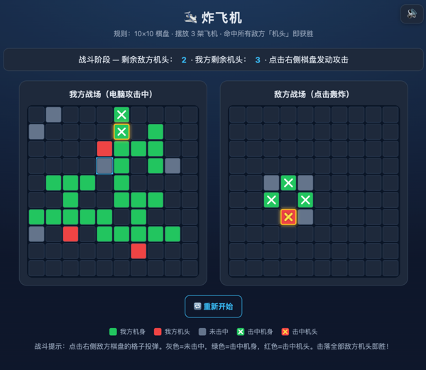

# 炸飞机 BattlePlane for VS Code

[](https://marketplace.visualstudio.com/items?itemName=zhanwangfeng.battle-plane-vscode)
[](https://marketplace.visualstudio.com/items?itemName=zhanwangfeng.battle-plane-vscode)

在 VS Code 中直接游玩经典「炸飞机」小游戏的扩展插件。

- GitHub: https://github.com/zhanwangfeng/BattlePlaneForVSCode
- VSCode: https://marketplace.visualstudio.com/items?itemName=zhanwangfeng.battle-plane-vscode

## 游戏截图



## 1. 插件说明

- **功能**：通过内置 Webview 在编辑器内运行「炸飞机」，不离开 VS Code 即可休闲对战。
- **入口**：活动栏「炸飞机」开始树，或命令面板执行 `炸飞机：打开游戏`。
- **主要特性**：
  - 10×10 棋盘，双盘对战（我方 / 敌方）。
  - 布局阶段摆放 **3 架飞机**，可旋转（`R` 或按钮）、可相邻、不可重叠，支持随机排列。
  - 战斗阶段回合制：点击敌方棋盘投弹，电脑自动反击。
  - 轰炸反馈：灰色=未击中、绿色+叉叉=击中机身、红色+叉叉=击中机头。
  - 命中机头播放多音符爆炸音效；命中机身播放爆炸音效；未击中低沉音；胜负各有旋律。
  - 右上角 🔊 音效开关；棋盘内「重开一局」随时重来。
  - 游戏结束揭晓敌方全部飞机（绿机身 / 红机头）。
- **规则简介**：
  - 每方 3 架飞机隐藏在棋盘上，飞机由机头、机身、机翼、尾翼组成（共 10 格）。
  - 轮到你时轰炸敌方任意格子，系统反馈「未击中 / 击中机身 / 击中机头」。
  - 率先击落敌方 **全部 3 个机头** 即获胜；我方全部机头被击落则失败。
- **操作按键**：
  - 鼠标：布局阶段点击放置机头、悬停预览；战斗阶段点击敌方格子投弹。
  - `R`：布局阶段旋转待放置的飞机。
  - 按钮：随机排列、清空、确认开战、重开一局、音效开关。

## 2. 插件启动说明

### 方式一：VS Code 插件市场安装（推荐）

1. 打开 VS Code，进入扩展市场（快捷键 `Cmd/Ctrl + Shift + X`）。
2. 搜索 **`炸飞机`**（或本插件发布名 `battle-plane-vscode`），点击 **安装**。
3. 安装完成后，点击活动栏的 **炸飞机** 图标打开开始树，点击「开始游戏」即可；或按 `Cmd/Ctrl + Shift + P` 执行命令 **`炸飞机：打开游戏`**。
4. 对局中可随时点击棋盘内的「重开一局」重新开始。

> 安装后若命令/视图未出现，可重启 VS Code 重新加载扩展。

### 方式二：本地源码调试运行（F5）

适用于从源码二次开发或本地预览：

1. 安装依赖：

   ```bash
   npm install
   ```

2. 使用 VS Code 打开本项目根目录，按 **F5** 启动调试。
   - 调试前会自动编译 TypeScript（`src` → `out`）并后台监听改动。
   - VS Code 会打开一个新的「扩展开发宿主」窗口。
3. 在扩展开发窗口中，点击活动栏 **炸飞机** 图标打开开始树并点击「开始游戏」，或执行命令 **`炸飞机：打开游戏`** 即可游玩。

### 其他编译方式

- 单次编译：`npm run compile`
- 监听编译：`npm run watch`（调试时修改代码自动重新编译，重跑命令即生效）
- 打包发布：`npm run package`（自动先执行 `vscode:prepublish` 编译，生成带版本号的 .vsix）
